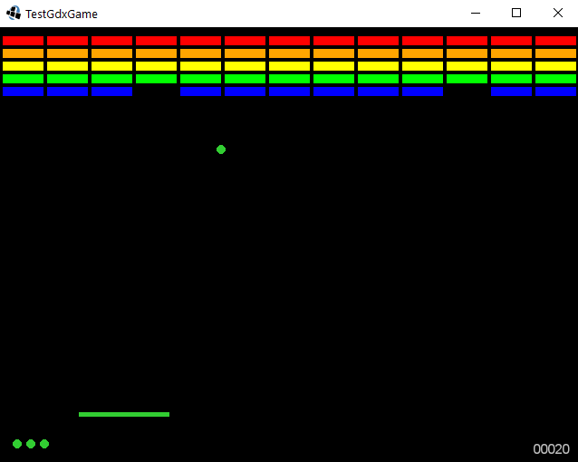

# test-gdx-game
_breakout clone_

lib gdx game based on [HelloLibgdx](https://colourtann.github.io/HelloLibgdx/)

---
## Release History:

0.0.5
* looping [wolfram](http://tones.wolfram.com/generate) background track
* 3 lives

0.0.4
* [bfxr](https://www.bfxr.net/) sounds

0.0.3
* Part 3 with colorful blocks and score

0.0.2
* Part 2 with working paddle collisions

0.0.1
* Part 1 with colorful bouncing balls that don't go offscreen

